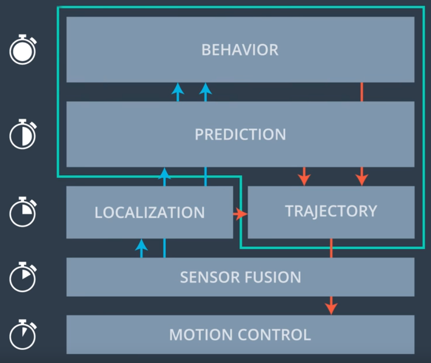
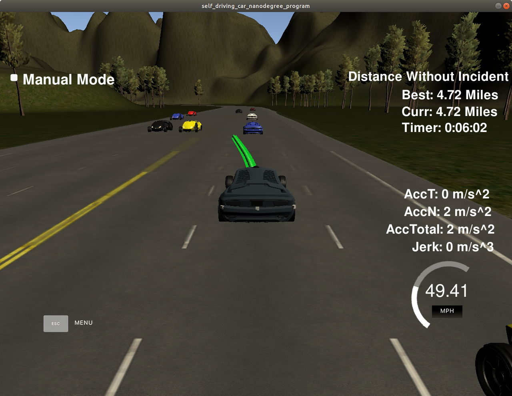

# Highway Driving

## _A project of Self-Driving Car Engineer Nanodegree_

  

### The goals of this project are the following:

- Design a path planner that is able to create smooth, safe paths for the car to follow along a 3 lane highway with traffic.
- A successful path planner will be able to keep inside its lane, avoid hitting other cars, and pass slower moving traffic all by using localization, sensor fusion, and map data.

---

### Path Planner

This path planner includes the following modules:

- prediction
- behavior planning
- trajectory generation

The following block diagram illustrates how modules interact with each other, and their relative frequency, where the behavior planner is usually for a much longer horizon and sensor fusion is processed in a more frequent manner.

#### Prediction

Sensor fusion data is used to predict other vehicle behaviors in the near future. The module checks the followings:

- if there is a car in front in near future
- if there is enough gaps on both right and/or left lanes for safe lane merging

#### Behavior Planning

Based on the outputs from the prediction module, behavior planner will make decision from the following options:

- keep lane
  - keep speed
  - increase speed if running under speed limit
  - decrease speed if car in front within 30 meters
- change to left lane if gap greater than 30 meters
- change to right lane if gap greater than 30 meters

#### Trajectory Generation

Jerk minimized trajectory generation using spline. There are 50 waypoints generated for each cycle, and previous waypoints are used to generate new waypoints for reduced jerk.

Spline is generated in Frenet coordinate with respect to our cars local coordinate. And it is interpolated up to 30 meters for smooth velocity association with waypoints.

---

### Build the Application

Make sure the script `install-ubuntu.sh` has been executed to install necessary libs that enable communication between this application and the simulator.

Clone this repo and run the following commands:

- `mkdir build && cd build`
- `cmake .. && make`
- `./path_planning`

### Demo Run

Here is a video recording to show the path planner in action.

  

As shown in the above video clip, the car is able to navigate through a 3-lane traffic smoothly.
